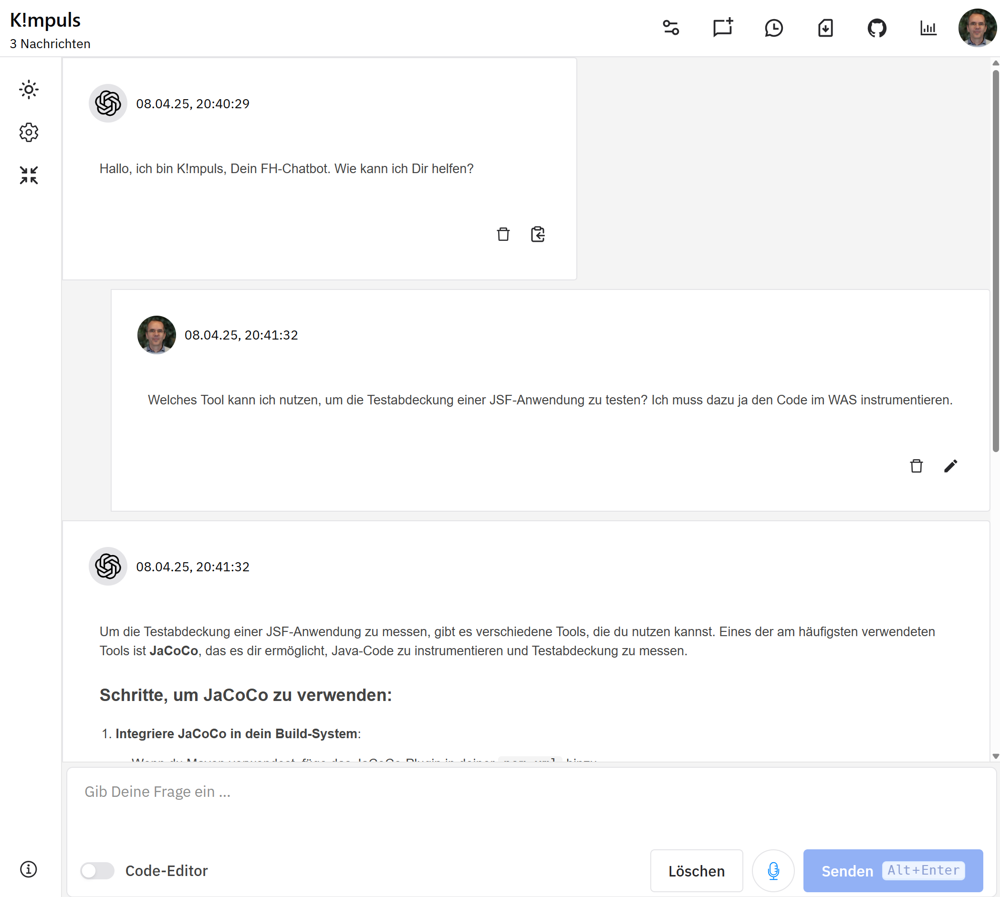

# OpenAI-UI – A simple UI for OpenAI's Chat API

This is a simple UI for OpenAI's chat (and assistant) API. It is designed to be used either directly with the API or through a [proxy server](htts://github.com/fhswf/openai-proxy) that can be used to manage the API key ans provide a privacy-friendly way to use the API. 

This project is based on 
[ninasaul/chat-gpt-ui](https://github.com/ninasaul/chat-gpt-ui.git).

## Features

- Chat with OpenAI's [chat completions API](https://platform.openai.com/docs/guides/text-generation/chat-completions-api)
- Chat with OpenAI's [assistants API](https://platform.openai.com/docs/assistants/overview)
- Access via a proxy server for privacy.
- Single Sign-On (SSO) via OpenID Connect (OIDC) for authentication.
- Markdown support for chat messages.
- Code editor for chat messages.